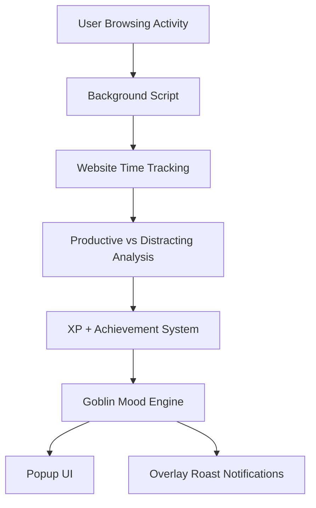
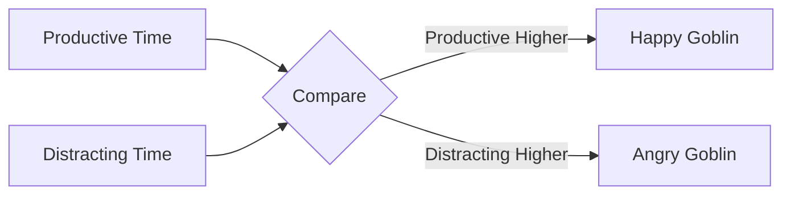
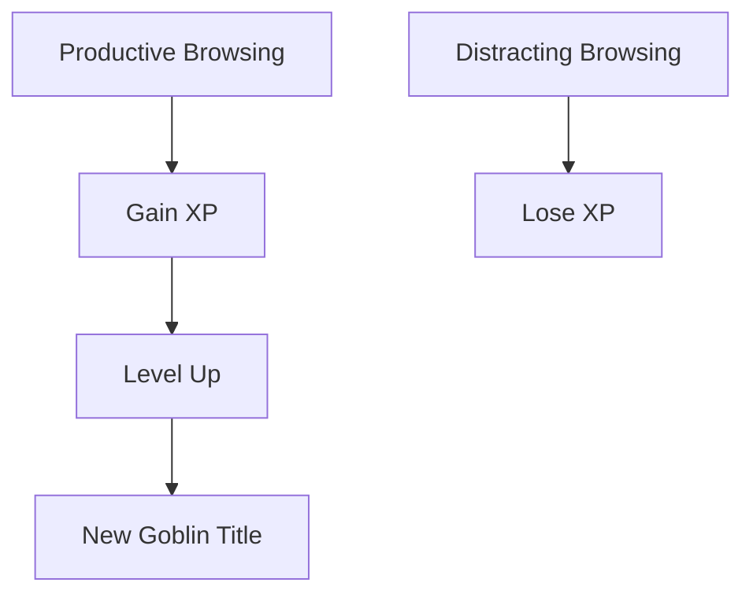

# 👺 Productivity Goblin

> A chaotic little Chrome extension that watches your browsing habits, judges your life choices, and evolves based on your productivity.

Productivity Goblin transforms your browser into a sarcastic retro-style virtual pet experience.
It tracks how you spend time online, categorizes your browsing behavior, and reacts with evolving moods, achievements, XP progression, and hilarious roasts.

Think:

* 🧠 productivity tracker
* 👾 Tamagotchi pet
* 🎮 retro RPG UI
* 💀 internet-induced emotional damage

all combined into one tiny goblin.

---

# ✨ Features

## 🌐 Website Tracking

* Tracks active browsing time
* Categorizes websites as:

  * productive
  * distracting
* Stores data locally using Chrome Storage API

---

## 👺 Dynamic Goblin Moods

The goblin reacts to your browsing behavior in real time.

Examples:

* happy goblin
* disappointed goblin
* angry goblin

---

## 💀 Sarcastic Roast System

Randomized roasts appear based on your activity.

Example:

> "Your attention span is collapsing."

> "You opened YouTube again?"

> "Goblin grants you temporary respect."

---

## 🎮 XP + Leveling System

Earn XP from productive browsing and level up your goblin.

| Action              | XP  |
| ------------------- | --- |
| Productive browsing | +XP |
| Doomscrolling       | -XP |

Goblin titles evolve as you progress:

* Tiny Menace
* Cave Goblin
* Focus Fiend
* Chaos Wizard

---

## 🏆 Achievement System

Unlock achievements based on your behavior.

Examples:

* 🏆 Locked In
* 💻 Code Goblin
* 🧠 Brainrot
* 🕸️ Tab Wanderer

---

## 📢 Overlay Roast Notifications

Distracting websites trigger floating goblin interruptions.

Example:

> "Back again? Incredible lack of self-control."

---

## 🎨 Retro Pixel UI

Inspired by:

* retro RPG menus
* indie games
* terminal aesthetics
* pixel-art interfaces

Built using:

* Pixelify Sans
* muted green CRT-style palette
* floating sprite animations
* glowing UI effects

---

# 🧱 Tech Stack

| Technology            | Purpose                |
| --------------------- | ---------------------- |
| JavaScript            | Core logic             |
| Chrome Extension APIs | Browser integration    |
| HTML/CSS              | UI                     |
| Chrome Storage API    | Persistent data        |
| Manifest V3           | Extension architecture |

---

# 🏗️ Architecture



---

# 🧠 Goblin Mood Logic



---

# 🎮 XP System



---

# 📂 Project Structure

```txt
productivity-goblin/
│
├── manifest.json
├── background.js
├── content.js
├── popup.html
├── popup.css
├── popup.js
│
├── assets/
│   ├── happy.png
│   ├── angry.png
│   ├── disappointed.png
│   ├── evil.png
│   └── icon.png
│
└── README.md
```

---

# 🚀 Installation

## 1. Clone Repository

```bash
git clone https://github.com/yourusername/productivity-goblin.git
```

---

## 2. Open Chrome Extensions

Go to:

```txt
chrome://extensions
```

Enable:

* ✅ Developer Mode

---

## 3. Load Extension

Click:

```txt
Load unpacked
```

Select:

```txt
productivity-goblin/
```

---


# 🌱 Future Ideas

* 👺 Goblin evolution forms
* 📈 Weekly roast reports
* 🔊 Retro sound effects
* 🤖 AI-generated personalized roasts
* ☁️ Cloud sync
* 🏅 Advanced achievement system

---

# 💡 Why I Built This

Most productivity tools feel:

* corporate
* sterile
* emotionally empty

Productivity Goblin was built to make productivity feel:

* funny
* self-aware
* game-like
* chaotic
* human

The goal was to create something people would actually enjoy interacting with instead of another boring dashboard.

---

# 👺 Final Words

Your goblin is always watching.

Choose your tabs wisely.
